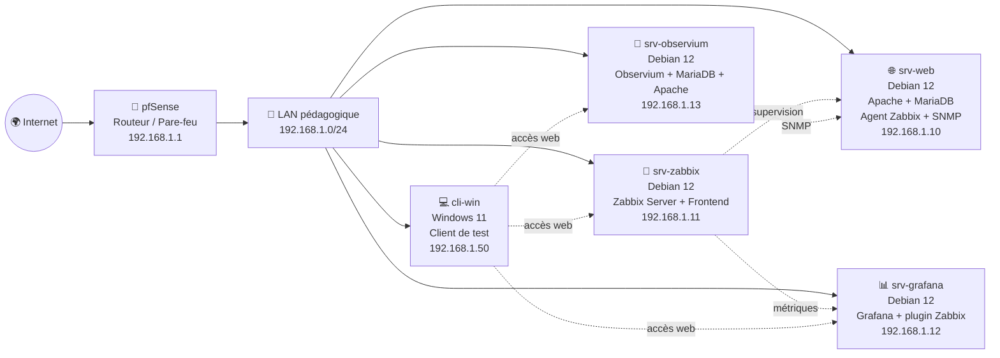

# 🛰️ TP Supervision réseau et système


> 🎯 **Objectif du dépôt**  
> Construire un laboratoire pédagogique de supervision réseau et système avec **pfSense**, **Debian 12**, **Zabbix**, **Grafana**, **Observium**, **SNMP**, des agents de supervision et un poste client **Windows 11**.

---

## 📚 Sommaire

- [🧭 Vue d’ensemble](#-vue-densemble)
- [🖼️ Architecture cible](#️-architecture-cible)
- [🧱 Topologie des machines](#-topologie-des-machines)
- [🚀 Ordre d’installation conseillé](#-ordre-dinstallation-conseillé)
- [📂 Organisation du dépôt](#-organisation-du-dépôt)
- [✅ Vérifications attendues](#-vérifications-attendues)
- [🛡️ Bonnes pratiques sécurité](#️-bonnes-pratiques-sécurité)
- [🧑‍🏫 Exploitation pédagogique](#-exploitation-pédagogique)

---

## 🧭 Vue d’ensemble

Ce TP permet d’apprendre à :

- 🧩 déployer plusieurs machines virtuelles spécialisées ;
- 🌐 configurer une topologie réseau autour d’un routeur **pfSense** ;
- 📡 superviser des hôtes Linux et Windows ;
- 📊 visualiser les métriques avec **Zabbix** et **Grafana** ;
- 🔎 découvrir la supervision réseau avec **Observium** ;
- 🧪 tester les agents, SNMP, services web et bases de données ;
- 🛡️ introduire les bonnes pratiques de durcissement après installation.

---

## 🖼️ Architecture cible



---

## 🧱 Topologie des machines

| Picto | VM | OS | Rôle | Adresse IP |
|---|---|---|---|---|
| 🧱 | `pfSense` | FreeBSD / pfSense CE | Routeur Internet, passerelle et pare-feu | `192.168.1.1` |
| 🌐 | `srv-web` | Debian 12 | Apache, MariaDB, agent Zabbix, SNMP | `192.168.1.10` |
| 📡 | `srv-zabbix` | Debian 12 | Zabbix Server, Frontend Web, Agent | `192.168.1.11` |
| 📊 | `srv-grafana` | Debian 12 | Grafana et plugin Zabbix | `192.168.1.12` |
| 🔎 | `srv-observium` | Debian 12 | Observium Community, MariaDB, Apache | `192.168.1.13` |
| 💻 | `cli-win` | Windows 11 | Poste client d’administration et de tests | `192.168.1.50` |

### 🌐 Paramètres réseau

| Élément | Valeur |
|---|---|
| Réseau LAN | `192.168.1.0/24` |
| Passerelle | `192.168.1.1` |
| DNS | `8.8.8.8` ou pfSense |
| Domaine pédagogique possible | `formation.lan` |

---

## 🚀 Ordre d’installation conseillé

1. 🧱 Installer **pfSense** et configurer le LAN en `192.168.1.1/24`.
2. 🐧 Installer les **4 VM Debian 12 minimales**.
3. ⚙️ Sur chaque VM Debian, lancer le script commun :

   ```bash
   sudo bash linux/00-common-debian12.sh
   ```

4. 🎯 Lancer le script correspondant au rôle de la machine :

   | Machine | Script à exécuter |
   |---|---|
   | 🌐 `srv-web` | `linux/10-install-srv-web.sh` |
   | 📡 `srv-zabbix` | `linux/20-install-srv-zabbix.sh` |
   | 📊 `srv-grafana` | `linux/30-install-srv-grafana.sh` |
   | 🔎 `srv-observium` | `linux/40-install-srv-observium.sh` |

5. 💻 Sur Windows 11, lancer PowerShell en administrateur puis exécuter :

   ```powershell
   .\windows\config-cli-win.ps1
   ```

6. ✅ Vérifier les accès web depuis le poste client.

---

## 📂 Organisation du dépôt

```text
TP-SUPERVISON/
├── README.md
├── linux/
│   ├── 00-common-debian12.sh
│   ├── 10-install-srv-web.sh
│   ├── 20-install-srv-zabbix.sh
│   ├── 30-install-srv-grafana.sh
│   ├── 40-install-srv-observium.sh
│   └── README.md
└── windows/
    ├── config-cli-win.ps1
    └── README.md
```

---

## 🔐 Comptes pédagogiques

> ⚠️ Les comptes et mots de passe utilisés par les scripts sont destinés à un **contexte de TP uniquement**.  
> En environnement réel, il faut remplacer immédiatement les identifiants par des secrets forts, uniques et stockés proprement.

| Service | Compte attendu | Remarque |
|---|---|---|
| 📡 Zabbix | Compte administrateur Zabbix | À changer après installation |
| 📊 Grafana | Compte administrateur Grafana | À changer à la première connexion |
| 🔎 Observium | Compte administrateur Observium | À changer après validation |
| 🗄️ MariaDB | Comptes applicatifs | À réserver au lab pédagogique |
| 📡 SNMP | Communauté de test | À ne pas utiliser en production |

---

## ✅ Vérifications attendues

Depuis le poste client **Windows 11** ou depuis une machine du LAN :

| Service | URL | Résultat attendu |
|---|---|---|
| 🌐 Serveur web | `http://192.168.1.10` | Page Apache ou page de test |
| 📡 Zabbix | `http://192.168.1.11/zabbix` | Interface Zabbix accessible |
| 📊 Grafana | `http://192.168.1.12:3000` | Interface Grafana accessible |
| 🔎 Observium | `http://192.168.1.13/observium` | Interface Observium accessible |

### 🧪 Commandes utiles de contrôle

```bash
# Vérifier la connectivité
ping 192.168.1.1
ping 192.168.1.10
ping 192.168.1.11
ping 192.168.1.12
ping 192.168.1.13

# Vérifier les ports web
curl -I http://192.168.1.10
curl -I http://192.168.1.11/zabbix
curl -I http://192.168.1.12:3000
curl -I http://192.168.1.13/observium

# Vérifier SNMP depuis une machine Linux
snmpwalk -v2c -c <communaute_snmp_lab> 192.168.1.10 system
```

---

## 🛡️ Bonnes pratiques sécurité

À faire après validation pédagogique du TP :

- 🔑 changer tous les mots de passe par défaut ;
- 🧯 limiter les accès d’administration aux seules IP nécessaires ;
- 🔐 activer HTTPS sur les interfaces web ;
- 🧾 documenter les comptes créés et les ports ouverts ;
- 🧱 durcir les règles pfSense ;
- 📦 mettre à jour Debian, pfSense, Zabbix, Grafana et Observium ;
- 📡 éviter la communauté SNMP par défaut en environnement réel ;
- 🧑‍💻 utiliser des comptes nominatifs plutôt qu’un compte partagé.

---

## 🧑‍🏫 Exploitation pédagogique

| Séance | Objectif pédagogique | Livrable apprenant |
|---|---|---|
| 1 | Installer l’architecture de base | Topologie validée et IP configurées |
| 2 | Déployer Zabbix | Hôtes supervisés et captures d’écran |
| 3 | Déployer Grafana | Dashboard connecté à Zabbix |
| 4 | Déployer Observium | Supervision SNMP fonctionnelle |
| 5 | Réaliser la recette | Fiche de tests complète |
| 6 | Durcir l’environnement | Mesures correctives proposées |

---

## 📌 Remarques importantes

- 🐧 Les scripts Linux sont prévus pour **Debian 12**.
- 🔐 Les scripts doivent être lancés avec les droits `root` ou via `sudo`.
- ⚠️ Le script `00-common-debian12.sh` peut modifier la configuration IP : lance-le depuis la console VMware/KVM, pas depuis une session SSH distante.
- 🔎 Pour Observium, le device `srv-web` est ajouté automatiquement si le SNMP de `srv-web` répond déjà.
- 📊 Pour Grafana, le plugin Zabbix est installé. Selon la version, l’application Zabbix peut nécessiter une activation manuelle dans l’interface Grafana.

---

## 🏁 Résultat attendu

À la fin du TP, l’apprenant doit disposer d’un mini-SI supervisé avec :

- ✅ un routeur/passerelle pfSense opérationnel ;
- ✅ un serveur web Linux supervisé ;
- ✅ un serveur Zabbix fonctionnel ;
- ✅ un tableau de bord Grafana ;
- ✅ une interface Observium ;
- ✅ un client Windows 11 capable d’accéder aux services ;
- ✅ une première compréhension des flux, ports, agents et protocoles de supervision.

---

<p align="center">
  <strong>🛰️ TP Supervision réseau et système — laboratoire pédagogique prêt à l’emploi</strong><br>
  <em>Formation ingénierie informatique, systèmes, réseaux et cybersécurité</em>
</p>
